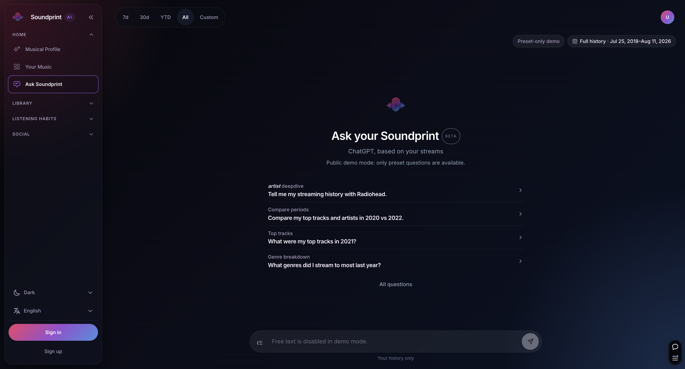

# Soundprint-AI

  

  <strong>Everything on your streams.</strong> 
  Personal analytics for Apple Music and Spotify — trends, musical identity, AI chat, and friend duels.

  <a href="README.md">English</a> · <a href="README_FR.md">Français</a>

  
  
  
  

**Soundprint-AI** turns your own listening history into a private dashboard: import once from Apple Music or Spotify, then explore stats, habits, and taste over time. Optional Groq-powered AI lets you ask questions in natural language. **Duet** lets accepted friends compare libraries head-to-head.

This GitHub repository is still named [`apple-music-analytics`](https://github.com/wesleyajavon/apple-music-analytics) — that was the original project name. The product is **Soundprint-AI**. See [Repository name](#repository-name) if you are forking or linking to this repo.

Live demo: **[soundprint-ai.com](https://www.soundprint-ai.com/)**. Default locale is French; English and Spanish live at `/en` and `/es`. Anonymous visitors can try a **public demo** on the live site.

  

Not affiliated with Apple, Spotify, Last.fm, or Groq.

---

## Table of contents

- [Features](#features)
- [How data gets in](#how-data-gets-in)
- [Tech stack](#tech-stack)
- [Documentation](#documentation)
- [Repository name](#repository-name)
- [License](#license)

## Features

### Explore your library

- **Your Music** — global stats (streams, artists, tracks, listening time) plus tops and a period filter (7d / 30d / YTD / all / custom)
- **Pulse chart & heatmap** — volume over time and a GitHub-style calendar of listening intensity
- **Rhythm lab** — habits by hour and day of week
- **Musical Profile** — a persona built from your streaming patterns
- **Artists, tracks, genres** — rankings, deep dives, and trend charts (day / week / month)
- **Palette** — map unknown genres onto the artists and tracks that actually move your stats

### Interact

- **Ask your Soundprint** — chat with your data through allowlisted analytics tools (tops, streaks, artist deep dives, era vs era). No free-form SQL
- **Insight cards & taste shifts** — optional Groq summaries of what rankings hide, and week-to-week taste changes
- **Share cards** — downloadable images for duels and highlights

### Duet (friends)

- Email invites, accept / decline, block
- Explicit **share scopes** (`aggregates` or `full`) — nothing is compared until both sides opt in
- Head-to-head on an **artist, track, or genre** (“who streamed this more?”)
- **A friend’s Your Music** — read-only hub (KPIs, tops, timeline) for an accepted friend
- Not a social network: no follow graph, no public profiles, no feed

### Account & product

- Guided onboarding (Apple Music CSV or Spotify privacy ZIP)
- Supabase Auth (email sign-in / sign-up)
- Settings: GDPR export and account deletion, Groq AI consent, Duet sharing defaults
- i18n: French (default), English, Spanish (`next-intl`)
- Light / dark theme, mobile and desktop layouts
- Legal pages: privacy, terms, cookies

## How data gets in

Soundprint does **not** require a paid Apple Music or Spotify developer API on the user’s side.

1. Stream as usual on Apple Music or Spotify.
2. Request a copy of your listening history from Apple (CSV) or Spotify (ZIP).
3. Create an account and drop the file into **onboarding**.
4. Listens are normalized into PostgreSQL; charts update from that store.
5. Re-import anytime from Settings if you want a longer history.

Genre coverage can be improved with Palette in the app.

## Tech stack

| Layer | Choice |
|-------|--------|
| App | [Next.js](https://nextjs.org/) 14 (App Router), React 18, TypeScript |
| UI | Tailwind CSS, Recharts / D3, Motion |
| i18n | next-intl (`fr` default, `en`, `es`) |
| Auth | [Supabase Auth](https://supabase.com/auth) (SSR cookies) |
| Data | PostgreSQL + [Prisma](https://www.prisma.io/) |
| Cache / rate limits | Redis (ioredis) or [Upstash](https://upstash.com/) REST |
| AI (optional) | [Groq](https://groq.com/) — insights, chat, taste copy, genre backfill |
| Observability | Sentry, Vercel Analytics |
| Tests | Vitest, Playwright |
| Hosting | [Vercel](https://vercel.com/) |

## Documentation

| Doc | What it covers |
|-----|----------------|
| [`STACK.md`](STACK.md) | Libraries, infra, and how they are used |
| [`docs/APP_FLOW.md`](docs/APP_FLOW.md) | Auth, onboarding, and data-flow diagrams |
| [`docs/API.md`](docs/API.md) | HTTP endpoint reference (also copied to `public/docs/API.md` on build) |
| [`docs/DUET.md`](docs/DUET.md) | Friend graph, compare, share scopes |
| [`docs/DB_ENV_WORKFLOW.md`](docs/DB_ENV_WORKFLOW.md) | Prisma migrate vs push, local vs prod |
| [`docs/SUPABASE_AUTH_IMPLEMENTATION.md`](docs/SUPABASE_AUTH_IMPLEMENTATION.md) | Auth wiring |
| [`IDEAS_BAG.md`](IDEAS_BAG.md) | Product ideas and historical codenames |

TypeDoc HTML for `lib/services/**` and `lib/dto/**` is generated with `npm run docs:generate`. `docs/API.md` is hand-written and is **not** produced by TypeDoc.

## Repository name

| What | Value |
|------|--------|
| Product | **Soundprint-AI** (short: Soundprint) |
| GitHub repo | [`wesleyajavon/apple-music-analytics`](https://github.com/wesleyajavon/apple-music-analytics) |
| `package.json` `name` | `apple-music-analytics` (private; not published to npm) |
| Live URL | [soundprint-ai.com](https://www.soundprint-ai.com/) |

Keeping the GitHub slug is fine: many products ship under a historical repo name, and GitHub’s social preview still works if the README leads with the product. If you later rename the repo to `soundprint-ai`, GitHub redirects the old URL automatically — then update clone commands, CI badge URLs, and any Vercel Git settings.

## Contributing

Issues and pull requests are welcome. CI runs TypeScript, ESLint, and Vitest on every push and PR; Playwright E2E runs on `main` (see [`.github/workflows/README.md`](.github/workflows/README.md)).

Please keep user-facing copy in **en / fr / es** (`messages/*.json`) when you change UI text.

## License

[MIT](LICENSE)
