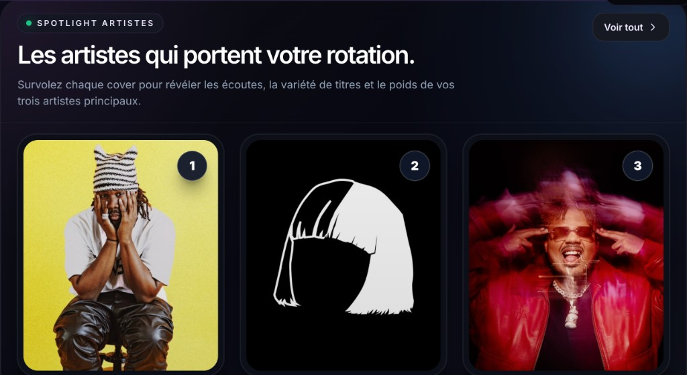

# Soundprint-AI

<p align="center">
  
</p>

<p align="center">
  <strong>Vos écoutes, visualisées.</strong><br>
  Analytics personnelles pour Apple Music et Spotify — tendances, identité musicale, chat IA et duels entre amis.
</p>

<p align="center">
  <a href="README.md">English</a> · <a href="README_FR.md">Français</a>
</p>

<p align="center">
  <a href="https://github.com/wesleyajavon/apple-music-analytics/actions/workflows/ci.yml"></a>
  <a href="LICENSE"></a>
  
  
</p>

**Soundprint-AI** transforme votre historique d’écoute en tableau de bord privé : un import Apple Music ou Spotify, puis stats, habitudes et goûts dans le temps. L’IA Groq (optionnelle) permet de poser des questions en langage naturel. **Duet** compare les bibliothèques d’amis qui ont accepté.

Le dépôt GitHub s’appelle toujours [`apple-music-analytics`](https://github.com/wesleyajavon/apple-music-analytics) — c’était le nom d’origine du projet. Le produit s’appelle **Soundprint-AI**. Voir [Nom du dépôt](#nom-du-dépôt) si vous forkez ou liez ce repo.

Démo en ligne : **[apple-music-analytics.vercel.app](https://apple-music-analytics.vercel.app/fr)** (locale par défaut : français ; l’anglais et l’espagnol sont sous `/en` et `/es`). Les visiteurs anonymes peuvent ouvrir une **démo publique** lorsque `NEXT_PUBLIC_PUBLIC_PROFILE_USER_ID` est configuré.

<p align="center">
  
</p>

Non affilié à Apple, Spotify, Last.fm ou Groq.

---

## Sommaire

- [Fonctionnalités](#fonctionnalités)
- [Origine des données](#origine-des-données)
- [Stack technique](#stack-technique)
- [Démarrage](#démarrage)
- [Scripts](#scripts)
- [Documentation](#documentation)
- [Nom du dépôt](#nom-du-dépôt)
- [Licence](#licence)

## Fonctionnalités

### Explorer sa bibliothèque

- **Your Music** — stats globales (écoutes, artistes, titres, temps) avec tops et filtre de période (7j / 30j / YTD / tout / custom)
- **Pulse chart et heatmap** — volume dans le temps et calendrier type GitHub
- **Rhythm lab** — habitudes par heure et jour de la semaine
- **Profil musical** — persona construite à partir de vos patterns d’écoute
- **Artistes, titres, genres** — classements, deep dives et tendances (jour / semaine / mois)
- **Palette** — rattacher les genres « Unknown » aux artistes et titres qui pèsent vraiment

### Interagir

- **Interroger Soundprint** — chat sur vos données via des outils analytics allowlistés (tops, séries, deep dive artiste, ère vs ère). Pas de SQL libre
- **Insight cards et évolution des goûts** — synthèses Groq optionnelles, et changements semaine par semaine
- **Cartes de partage** — images téléchargeables pour duels et highlights

### Duet (amis)

- Invitations par e-mail, acceptation / refus, blocage
- **Niveaux de partage** explicites (`aggregates` ou `full`) — rien n’est comparé tant que les deux côtés n’ont pas consenti
- Head-to-head sur un **artiste, titre ou genre** (« qui a le plus streamé ça ? »)
- **Your Music d’un ami** — hub en lecture seule (KPI, tops, timeline) pour un ami accepté
- Pas un réseau social : pas de follow, pas de profils publics, pas de fil

### Compte et produit

- Onboarding guidé (CSV Apple Music ou ZIP confidentialité Spotify)
- Auth Supabase (connexion / inscription e-mail)
- Paramètres : export RGPD et suppression de compte, consentement IA Groq, défauts de partage Duet
- i18n : français (défaut), anglais, espagnol (`next-intl`)
- Thème clair / sombre, layouts mobile et desktop
- Pages légales : confidentialité, CGU, cookies

## Origine des données

Soundprint **n’exige pas** d’API développeur Apple Music ou Spotify payante côté utilisateur.

1. Écoutez comme d’habitude sur Apple Music ou Spotify.
2. Demandez une copie de votre historique à Apple (CSV) ou Spotify (ZIP).
3. Créez un compte et déposez le fichier dans **l’onboarding**.
4. Les écoutes sont normalisées dans PostgreSQL ; les graphiques partent de ce store.
5. Réimportez depuis les Paramètres si vous voulez un historique plus long.

**Chemins optionnels / mainteneur** (pas le flux produit principal) : sync Last.fm (`npm run lastfm:update`), import CSV Apple Music en CLI, sync Spotify Web API après OAuth. La couverture des genres s’améliore avec Palette dans l’app, ou avec les scripts `genres:*` / backfill Spotify.

## Stack technique

| Couche | Choix |
|--------|--------|
| App | [Next.js](https://nextjs.org/) 14 (App Router), React 18, TypeScript |
| UI | Tailwind CSS, Recharts / D3, Motion |
| i18n | next-intl (`fr` par défaut, `en`, `es`) |
| Auth | [Supabase Auth](https://supabase.com/auth) (cookies SSR) |
| Données | PostgreSQL + [Prisma](https://www.prisma.io/) |
| Cache / rate limits | Redis (ioredis) ou REST [Upstash](https://upstash.com/) |
| IA (optionnel) | [Groq](https://groq.com/) — insights, chat, textes de goût, backfill genres |
| Observabilité | Sentry, Vercel Analytics |
| Tests | Vitest, Playwright |
| Hébergement | Vercel (`prisma migrate deploy` au build Vercel ; en local, `npm run build` saute migrate) |

## Démarrage

**Prérequis :** Node.js 20+ (voir [`.nvmrc`](.nvmrc)), PostgreSQL, un projet Supabase avec Auth. Redis est optionnel en local ; en production, le rate limiting est fail-closed sans Redis.

```bash
git clone https://github.com/wesleyajavon/apple-music-analytics.git
cd apple-music-analytics
npm install
cp env.example .env.local
# Éditer .env.local — voir env.example pour la liste complète
npm run db:generate
npm run db:migrate:dev   # ou db:migrate / db:push selon votre flux
npm run dev
```

Ouvrir [http://localhost:3000](http://localhost:3000) (redirection vers la locale par défaut).

### Variables d’environnement

**Indispensables pour lancer l’app :** `DATABASE_URL`, `NEXT_PUBLIC_SUPABASE_URL`, `NEXT_PUBLIC_SUPABASE_PUBLISHABLE_KEY`.

Sur Vercel + Postgres poolé, préférer `POSTGRES_PRISMA_URL` pour l’app et `POSTGRES_URL_NON_POOLING` pour les migrations.

**Variables optionnelles fréquentes :** `GROQ_API_KEY` (IA), `REDIS_URL` / REST Upstash (cache et rate limits), `NEXT_PUBLIC_PUBLIC_PROFILE_USER_ID` (démo anonyme), `LASTFM_API_KEY` (scripts Last.fm mainteneur), DSN Sentry, chiffrement des tokens Spotify pour le sync OAuth. Liste complète : [`env.example`](env.example).

Workflow Prisma (dev vs prod) : [`docs/DB_ENV_WORKFLOW.md`](docs/DB_ENV_WORKFLOW.md). Notes auth : [`docs/SUPABASE_AUTH_IMPLEMENTATION.md`](docs/SUPABASE_AUTH_IMPLEMENTATION.md).

## Scripts

| Script | Description |
|--------|-------------|
| `npm run dev` | Serveur de développement |
| `npm run dev:turbo` | Dev avec Turbopack |
| `npm run build` | Build production — sur **Vercel**, `prisma migrate deploy` d’abord (`scripts/vercel-build.mjs`) ; en local, migrate ignoré |
| `npm run start` | Serveur production |
| `npm run lint` | ESLint (Next.js) |
| `npm run test:run` | Tests unitaires (Vitest) |
| `npm run test:integration` | Tests d’intégration API |
| `npm run test:e2e` | Tests E2E Playwright |
| `npm run db:migrate:dev` | Créer / appliquer les migrations en développement |
| `npm run db:migrate` | Appliquer les migrations (`prisma migrate deploy`) |
| `npm run db:studio` | Prisma Studio |
| `npm run vercel:env:pull` | Récupérer les variables Vercel dans `.env.local` |

<details>
<summary>Scripts données et genres (mainteneur)</summary>

| Script | Description |
|--------|-------------|
| `npm run apple-music:filter` | Filtrer un export Apple Music avant import CSV |
| `npm run apple-music:import` | Importer un CSV d’historique Apple Music |
| `npm run lastfm:update` | Récupérer les scrobbles Last.fm |
| `npm run listens:sync` / `listens:sync:lastfm` | Sync des écoutes depuis Apple Music / Last.fm |
| `npm run spotify:enrich-artist-images` | Compléter les images d’artistes via Spotify |
| `npm run genres:normalize` | Normaliser les libellés de genre après backfills |
| `npm run genres:map-top-unknown` | CLI interactive pour mapper les artistes « Unknown » |

Voir `package.json` et `docs/` pour les backfills LLM / cascade / consensus.

</details>

## Documentation

| Doc | Contenu |
|-----|---------|
| [`STACK.md`](STACK.md) | Libs, infra, et usage réel |
| [`docs/APP_FLOW.md`](docs/APP_FLOW.md) | Diagrammes auth, onboarding et flux de données |
| [`docs/API.md`](docs/API.md) | Référence des endpoints HTTP (copiée vers `public/docs/API.md` au build) |
| [`docs/DUET.md`](docs/DUET.md) | Graphe d’amis, compare, scopes de partage |
| [`docs/DB_ENV_WORKFLOW.md`](docs/DB_ENV_WORKFLOW.md) | Prisma migrate vs push, local vs prod |
| [`docs/SUPABASE_AUTH_IMPLEMENTATION.md`](docs/SUPABASE_AUTH_IMPLEMENTATION.md) | Auth |
| [`IDEAS_BAG.md`](IDEAS_BAG.md) | Idées produit et anciens noms de code |

Le HTML TypeDoc pour `lib/services/**` et `lib/dto/**` se génère avec `npm run docs:generate`. `docs/API.md` est rédigé à la main et **n’est pas** produit par TypeDoc.

## Nom du dépôt

| Quoi | Valeur |
|------|--------|
| Produit | **Soundprint-AI** (court : Soundprint) |
| Dépôt GitHub | [`wesleyajavon/apple-music-analytics`](https://github.com/wesleyajavon/apple-music-analytics) |
| `package.json` `name` | `apple-music-analytics` (privé ; non publié sur npm) |
| URL live | `apple-music-analytics.vercel.app` |

Garder le slug GitHub est tout à fait correct : beaucoup de produits vivent sous un nom de repo historique, et l’aperçu social GitHub fonctionne dès que le README mène avec le nom produit. Si vous renommez plus tard le repo en `soundprint-ai`, GitHub redirige automatiquement l’ancienne URL — il faudra alors mettre à jour les commandes `git clone`, les badges CI, et éventuellement le rattachement Git côté Vercel.

## Contribuer

Issues et pull requests bienvenues. La CI lance TypeScript, ESLint et Vitest à chaque push et PR ; les E2E Playwright tournent sur `main` (voir [`.github/workflows/README.md`](.github/workflows/README.md)).

Merci de tenir les copy utilisateur en **en / fr / es** (`messages/*.json`) quand vous touchez l’UI.

## Licence

[MIT](LICENSE)
