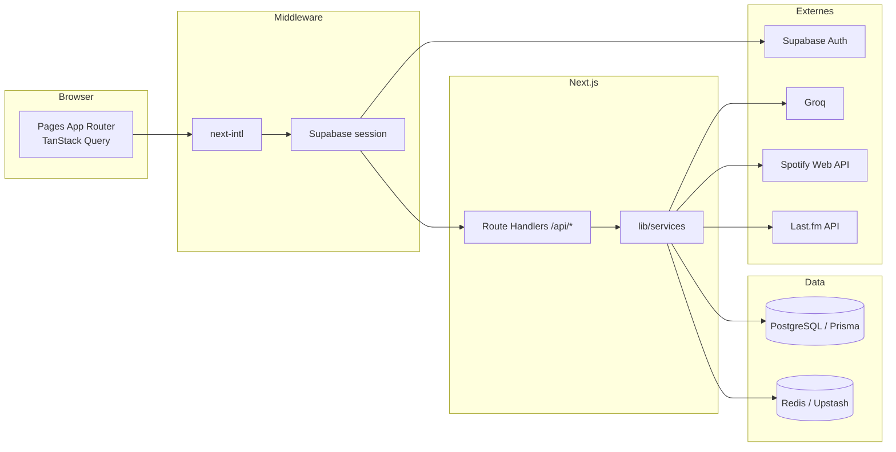

# Stack technique — Soundprint-AI

Vue d’ensemble des technologies **effectivement utilisées** par l’app. Le dépôt GitHub s’appelle encore [`apple-music-analytics`](https://github.com/wesleyajavon/apple-music-analytics) ; le produit est **Soundprint-AI**.

Produit et installation : [`README.md`](README.md) · [`README_FR.md`](README_FR.md). Flux runtime : [`docs/APP_FLOW.md`](docs/APP_FLOW.md).

**Runtime :** Node.js 20+ (voir [`.nvmrc`](.nvmrc)) · TypeScript 5.5 (strict) · Next.js **14.2** (App Router).

## Frontend

| Technologie | Version (package) | Usage |
|-------------|-------------------|--------|
| **Next.js** | 14.2 | App Router, RSC, Route Handlers, middleware |
| **React** | 18.3 | UI |
| **TypeScript** | 5.5 | Langage, `strict` |
| **Tailwind CSS** | 3.4 | Styles + thème clair / sombre |
| **next-intl** | 4.8 | i18n : `fr` (défaut), `en`, `es` — `messages/*.json` |
| **TanStack Query** | 5 | Cache et fetch client vers `/api/*` |
| **Recharts** | 2.12 | Graphiques (timeline, tendances, tops) |
| **D3** | 7.9 | Heatmap type GitHub |
| **Motion** | 12 | Animations (landing, Duet, profil musical) |
| **Lucide React** | 0.468 | Icônes |
| **Three.js** + R3F / Drei | 0.184 / 8 / 9 | Scène 3D de la landing (`lib/components/home-3d`) |
| **Sonner** | 2 | Toasts |
| **Canvas 2D** | (API navigateur) | Cartes de partage Duet (`lib/utils/share-card`) |

`react-force-graph-2d` est encore listé dans `package.json` / `transpilePackages` mais n’est **pas importé** dans l’app.

## Backend & API

| Technologie | Usage |
|-------------|--------|
| **Next.js Route Handlers** | REST sous `app/api/**` (analytics, IA, Duet, user, onboarding, Spotify, Last.fm) |
| **Zod** | Validation des schémas (query, body, tools chat) |
| **Prisma** 5.20 | ORM ; en prod Vercel, driver `@prisma/adapter-pg` + `pg` Pool via `POSTGRES_PRISMA_URL` |
| **PostgreSQL** | Store principal (`User`, `Listen`, `Artist`, `Track`, Duet, Palette, consents…) |
| **Redis** | Cache réponses IA, quota Groq TPM, rate limiting. **ioredis** (`REDIS_URL`) et/ou **Upstash REST** (`UPSTASH_REDIS_REST_*`) — préféré en serverless. En production, le rate limit est fail-closed sans Redis |

Couche métier : `lib/services/**` (listening, artists, genres, AI, duet, palette, Spotify). Authz data : `lib/auth/resolve-authorized-data-user-id.ts` (soi / démo) ; Duet : `assertFriendDataAccess` / `duet-compare-guard`.

## Auth & sécurité

| Technologie | Usage |
|-------------|--------|
| **Supabase Auth** | Email + mot de passe, cookies SSR (`@supabase/ssr`, `@supabase/supabase-js`) |
| **Middleware** | i18n + `updateSession` + gardes dashboard / démo publique / Palette |
| **Headers HTTP** | CSP et headers de sécu (`lib/security/security-headers.js`) |
| **Rate limiting** | Redis, fail-closed en prod ; observabilité admin `/api/admin/rate-limit/*` |

`User.id` = UUID Supabase `auth.users.id`. Notes : [`docs/SUPABASE_AUTH_IMPLEMENTATION.md`](docs/SUPABASE_AUTH_IMPLEMENTATION.md).

## Données & APIs externes

Le flux **produit** est l’import fichier en onboarding, pas une API streaming payante côté utilisateur.

| Source | Usage |
|--------|--------|
| **Apple Music CSV** | Historique Play History — onboarding + scripts `apple-music:*` |
| **Spotify ZIP** | Export confidentialité parsé avec **JSZip** |
| **Spotify Web API** | OAuth (même app que le provider Supabase), images artistes, sync récent, playground — optionnel |
| **Last.fm API** | Scripts / routes mainteneur (`lastfm:update`, `/api/lastfm`) — **pas** le parcours d’onboarding |
| **Groq** | IA optionnelle (`groq-sdk`) — insights, taste profile / evolution, commentaires tendances, **Ask your Soundprint** (tools allowlistés), backfill genres LLM |
| **Spotify CDN** (`i.scdn.co`) | Images artistes (allowlist `next/image`) |

## Tests

| Outil | Usage |
|-------|--------|
| **Vitest** 4 | Unitaires, intégration API (`__tests__/api`), perf |
| **Testing Library** | Composants React |
| **Playwright** 1.57 | E2E (job CI surtout sur `main`) |
| **@vitest/coverage-v8** | Couverture (lcov pour CI) |

## DevOps & monitoring

| Technologie | Usage |
|-------------|--------|
| **Vercel** | Hébergement. `npm run build` → `scripts/vercel-build.mjs` : `prisma migrate deploy` puis `next build`. En **local**, `build` saute migrate |
| **GitHub Actions** | `ci.yml` (lint, types, Vitest, build ; E2E sur `main`) · `test-coverage.yml` · cron `genre-backfill-scheduler.yml` |
| **Sentry** (`@sentry/nextjs` 10) | Erreurs client / serveur (optionnel) |
| **Vercel Analytics & Speed Insights** | Trafic et Web Vitals (`conditional-analytics`) |

Workflow Prisma : [`docs/DB_ENV_WORKFLOW.md`](docs/DB_ENV_WORKFLOW.md).

## Autres

| Technologie | Usage |
|-------------|--------|
| **@react-pdf/renderer** | Export rapport PDF (`/api/export/report`) |
| **TypeDoc** | HTML généré pour `lib/services/**` et `lib/dto/**` (`npm run docs:generate`) |
| **tsx** | Scripts TypeScript (sync, backfills, seed Prisma) |
| **ESLint** + `eslint-config-next` | Lint |

`docs/API.md` est rédigé à la main (pas TypeDoc) ; `docs:api:copy` le copie vers `public/docs/API.md` au build.

## Arborescence utile

| Chemin | Rôle |
|--------|------|
| `app/[locale]/` | Pages (landing, auth, dashboard, legal) |
| `app/api/` | Route Handlers |
| `lib/components/` | UI dashboard, Duet, onboarding, landing |
| `lib/services/` | Agrégats, IA, Duet, imports, Spotify |
| `lib/auth/`, `lib/supabase/` | Session, gardes, clients Supabase |
| `prisma/` | Schéma + migrations |
| `messages/` | Copy `en` / `fr` / `es` |
| `i18n/` | Routing next-intl |
| `scripts/` | Imports, genres, Last.fm, build Vercel |
| `__tests__/` | Vitest + Playwright |
