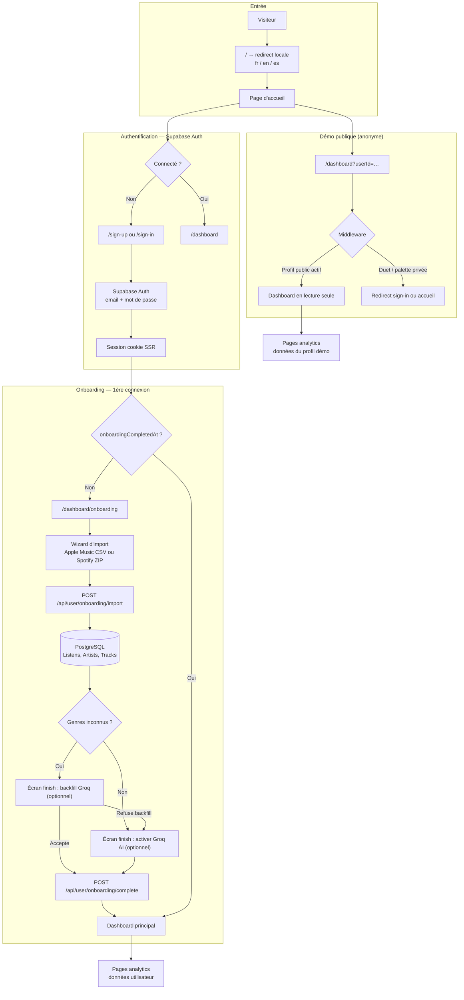
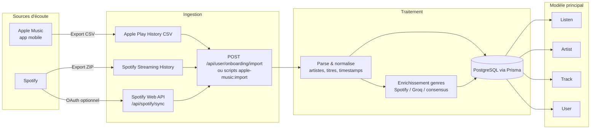
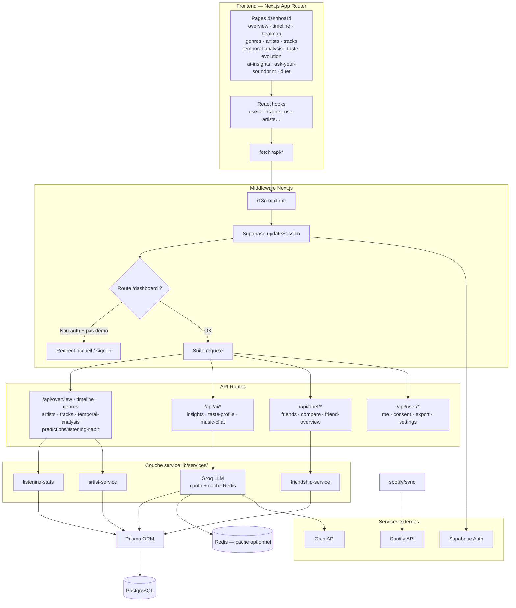
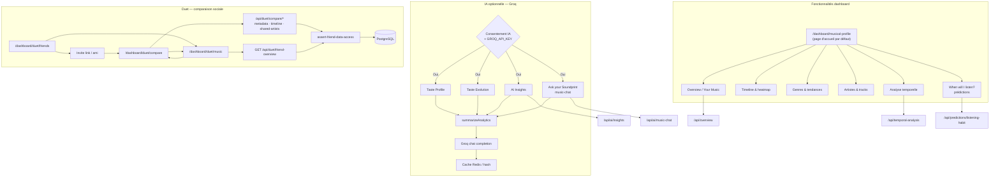

# Flux de l'application — Soundprint-AI

Diagrammes Mermaid décrivant l'architecture et les parcours principaux de **Apple Music Analytics** (Soundprint-AI).

## 1. Parcours utilisateur (auth & onboarding)

## 2. Pipeline de données (sources → base)

## 3. Architecture runtime (dashboard → API → services)

## 4. Fonctionnalités avancées (IA & Duet)

## Résumé

Un visiteur arrive sur la **landing i18n**, s'**authentifie via Supabase** (ou consulte la **démo publique**), passe par l'**onboarding d'import** (CSV Apple Music / ZIP Spotify), les écoutes sont **normalisées en PostgreSQL**, puis l'**écran final d'import** propose le **backfill genres Groq** et l'**opt-in IA** avant le dashboard — avec **Groq** en option pour l'IA et **Duet** pour comparer avec des amis.

**Accueil dashboard.** `/dashboard` et la fin d'onboarding mènent à `/dashboard/musical-profile` (hub narratif). Your Music (`/dashboard/overview`) est le hub analytique : faits d'abord, features ensuite. Mobile et laptop racontent la même histoire — période, insight concret (top titre / artiste), KPIs, un seul bloc de tops, tendances en onglets, calendrier + extraits IA, teaser vers le profil musical, puis Chat et Duet en « aller plus loin ». Tracks (`/dashboard/tracks`), Artists (`/dashboard/artists`) et Genres (`/dashboard/genres`) reprennent le même pattern de boutons de section : un panneau à la fois (fiches / Top 20 ou répartition / classement complet). La sidebar desktop liste Profil musical puis Your Music ; la barre mobile liste Profil, Your Music, Artistes, Titres, puis Plus (genres, timeline, heatmap, chat, Duet, réglages).

## Fichiers clés

| Zone | Fichiers |
|------|----------|
| Middleware & auth | `middleware.ts`, `lib/supabase/middleware.ts` |
| Onboarding | `app/[locale]/dashboard/onboarding/page.tsx`, `app/api/user/onboarding/import/route.ts` |
| Dashboard | `app/[locale]/dashboard/(main)/` |
| API analytics | `app/api/overview/`, `app/api/timeline/`, etc. |
| Schéma DB | `prisma/schema.prisma` |

## Voir aussi

- [`README.md`](../README.md) — setup et scripts
- [`docs/API.md`](API.md) — référence des endpoints
- [`docs/SUPABASE_AUTH_IMPLEMENTATION.md`](SUPABASE_AUTH_IMPLEMENTATION.md) — auth Supabase
