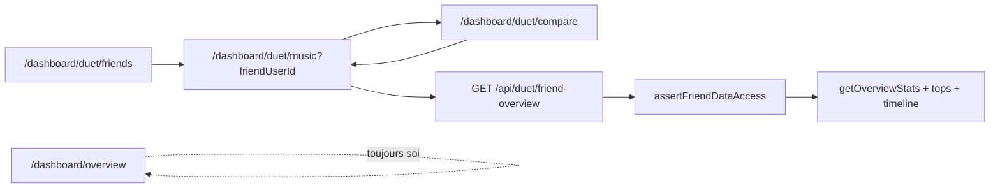

# Prompts Plan — Your Music d’un ami (Duet)

Playbook pour ouvrir le **Your Music d’un ami accepté** : même lecture analytique que l’overview (KPIs, tops, timeline), pas un head-to-head. Le graphe social existe déjà (Duet). On n’invente ni follow, ni fil, ni profils publics.

Une session Plan = **un prompt**. Ne pas lancer « tout le social » d’un coup. Après chaque implémentation : desktop + mobile ~390×844, **EN + FR** (ES si tu touches le copy), puis commit, puis l’étape suivante.

Référence Your Music (soi) : [`app/[locale]/dashboard/(main)/overview/page.tsx`](../app/[locale]/dashboard/(main)/overview/page.tsx)  
Garde ami : [`lib/services/duet/assert-friend-data-access.ts`](../lib/services/duet/assert-friend-data-access.ts)  
Garde compare (à réutiliser, pas à dupliquer) : [`lib/services/duet/duet-compare-guard.ts`](../lib/services/duet/duet-compare-guard.ts)  
Auth solo / démo : [`lib/auth/resolve-authorized-data-user-id.ts`](../lib/auth/resolve-authorized-data-user-id.ts)

Cadrage produit : [DUET.md](./DUET.md) · historique Phases 0–6 : [DUET_PLAYBOOK.md](./DUET_PLAYBOOK.md) · D1–D10 : [DUET_PHASE0_DECISIONS.md](./DUET_PHASE0_DECISIONS.md)

---

## Comment utiliser ce fichier

1. Ouvre une **nouvelle conversation en mode Plan**.
2. Colle d’abord le **préambule** (bloc suivant).
3. Colle **un seul** prompt numéroté.
4. Valide le plan, implémente, vérifie, commit.
5. Passe au numéro suivant. Ne saute pas l’étape 0 (privacy / copy) : sinon l’UI promet un partage que les textes légaux ne décrivent pas.

Hors scope de **chaque** prompt sauf mention contraire : follow, fil d’actualité, pseudos / profils publics, drill-down library ami (`/dashboard/tracks`, `/artists`, `/genres`), Musical Profile ami, chat, Maestro / insights IA sur données ami, desktop-only squeeze ou rewrite Overview soi.

---

## Préambule (à coller au début de CHAQUE prompt)

```text
Contexte Soundprint : dashboard Next.js App Router, i18n en/fr/es. Duet est déjà livré : Friendship + shareScope (none | aggregates | full), invitations, compare head-to-head. Auth = UUID Supabase = User.id.

Objectif de cette ligne de travail : un ami accepté peut ouvrir le Your Music de l’autre (lecture seule), pas seulement comparer un artiste / titre / genre.

Décisions déjà figées — ne pas les rouvrir :
- Route Duet, pas Overview : /dashboard/duet/music?friendUserId=<uuid> (même param que compare). L’onglet Your Music /dashboard/overview reste TOUJOURS la musique du viewer.
- Jamais réutiliser ?userId= pour un ami. C’est le canal démo publique. resolveAuthorizedDataUserId ignore tout UUID étranger (e2e auth-hardening). Ne pas élargir ce resolver à tous les endpoints analytics.
- Deux chemins d’authz, un moteur de stats : GET /api/duet/friend-overview après assertFriendDataAccess, puis les mêmes services (getOverviewStats, getTopArtists, répartition genres, agrégation timeline, tops tracks). Pas de copie SQL.
- Mapping shareScope (D2, pas de nouvel enum) :
  - aggregates : KPIs, timeline, top artistes, top genres — PAS de top titres, PAS de heatmap, PAS d’IA.
  - full : + top titres (heatmap optionnelle plus tard). Toujours PAS Maestro / Groq / ArtistUserInsightsPanel sur les données ami.
- Un seul shareScope mutuel sur Friendship. Pas d’asymétrie A→B dans ce MVP.
- Lecture seule : bannière « musique de {name} », CTA Comparer, pas d’Ask / import / settings / teaser Musical Profile / go-further Ask.
- Anti-énumération : 404 si pas ami accepted ; 403 si scope insuffisant (none). 401 sans session.
- Liens drill-down overview (tracks/artists/genres) : ne PAS les pointer vers /dashboard/tracks etc. (ce serait les données du viewer). Rangées non cliquables, ou href uniquement vers compare.

Interdit : follow, fil, découverte d’inconnus, ?userId= ami, friendUserId sur /api/overview|/api/timeline|/api/genres|/api/tracks, IA ami, ouvrir tout le dashboard en « view as ».

Avant de proposer un plan : lis assert-friend-data-access.ts, duet-compare-guard.ts, resolve-authorized-data-user-id.ts, overview/page.tsx, duet-friends-client.tsx, docs/GDPR_DPIA_DUET.md. Pose 1 question si le rôle de l’écran n’est pas clair.
```

---

## Règles d’architecture (pour toi, pas pour le modèle)

| Faire | Éviter |
| --- | --- |
| `friendUserId` + `assertFriendDataAccess` sur `/api/duet/*` | Étendre `resolveAuthorizedDataUserId` pour honorer un UUID ami |
| Réutiliser `requireDuetCompareAccess` (alias `requireDuetFriendAccess` OK) | Dupliquer parse UUID / 404 / 403 / rate limit |
| Composer `getOverviewStats` / `getTopArtists` / genres / timeline | Nouvelles requêtes SQL « friend overview » |
| Page sous `duet/music` + chrome Duet | `/dashboard/overview?userId=` ou `?friendUserId=` |
| Rangées tops en lecture ; CTA unique = Comparer | Réutiliser OverviewDesktopFlow tel quel (Ask, insights, heatmap, liens library soi) |
| Empty / 403 / 404 dédiés Duet | Toast générique ou page Overview soi en fallback (fuite d’identité) |
| i18n `duet.friendMusic.*` en/fr/es | Hardcoder « Your music » / coller le namespace `overview` sans sujet ami |

---

## Décisions produit (rappel — déjà tranchées)

1. **Pas un réseau follow.** Graphe d’amis Duet uniquement.
2. **Your Music ami ≠ Your Music soi.** Même *famille* de widgets, autre route, autre authz.
3. **`aggregates` suffit** pour visiter le hub (sans titres). **`full`** débloque les top titres.
4. **Pas de 3e onglet Duet SubNav** tant qu’aucun ami n’est sélectionné. Entrée = liste d’amis + compare. Sans `friendUserId` : empty + picker (pattern compare), pas une landing marketing.
5. **Démo publique** : `/dashboard/duet/music` reste **Fermer** (auth only), comme le reste de Duet (`duet/layout.tsx`, [PUBLIC_DEMO_ROUTES_ADVISORY.md](./PUBLIC_DEMO_ROUTES_ADVISORY.md)).



---

## Étape 0 — Cadrage privacy (faire en premier)

**Pourquoi en premier :** D2 décrit déjà timeline + tops artistes/genres (`aggregates`) et comparaisons entité (`full`). Consulter le Your Music d’un ami est **la même catégorie de données**, présentée comme un hub plutôt qu’en head-to-head. Si on ship l’UI sans le dire dans l’acceptation / la privacy, le consentement est incomplet.

Ne **pas** bumper `DUET_SHARING_CONSENT_VERSION` (`2026-06-09`) si le mapping reste dans D2. Bumper seulement si tu élargis réellement le traitement (ex. titres au niveau `aggregates`, heatmap jour par jour, IA).

```text
[Préambule]

Étape 0 — Cadrage privacy Your Music ami. Pas d’API ni d’UI produit.

Fichiers : docs/GDPR_DPIA_DUET.md, docs/GDPR_ROPA.md, docs/DUET_PHASE0_DECISIONS.md (note D2 si besoin), messages/{en,fr,es}.json (duet.inviteAccept.scopeAggregates / scopeFull, legal.privacy section « Partage avec amis (Duet) »), éventuellement docs/API.md en mention « à venir ».

Objectif :
- Documenter dans la DPIA que le périmètre fonctionnel inclut la consultation lecture seule du hub analytics ami (Your Music) selon shareScope, toujours entre amis accepted, toujours hors découverte publique.
- ROPA ligne « Partage Duet » : ajouter explicitement « consultation du Your Music ami (agrégats ; tops titres si full) ».
- Copy acceptation + privacy : un ami peut ouvrir tes stats agrégées (courbes, tops artistes et genres), pas seulement te comparer. full = + tops titres et défis entité. Toujours : pas de fil, pas de profil public.
- Ne pas changer DUET_SHARING_CONSENT_VERSION sauf élargissement réel du traitement.

Contraintes : pas de nouveau shareScope ; pas de follow ; FR/EN/ES alignés ; ton existant (clair, sans sur-promesse).

Livre : diff docs + i18n legal/invite uniquement. Checklist « ce qui change pour l’utilisateur ». Pas de route, pas de page.
```

---

## Étape 1 — API + authz

**But :** un endpoint Duet qui renvoie le payload overview **de l’ami**, derrière la même garde que compare. Overview soi et démo publique inchangés.

```text
[Préambule]

Étape 1 — GET /api/duet/friend-overview. Pas d’UI.

Fichiers : lib/services/duet/duet-compare-guard.ts (réutiliser requireDuetCompareAccess, ou alias requireDuetFriendAccess), lib/services/duet/assert-friend-data-access.ts, nouveau lib/services/duet/friend-overview-service.ts, app/api/duet/friend-overview/route.ts, lib/dto/duet.ts, docs/API.md, tests Vitest (nouveau __tests__/api/duet-friend-overview.test.ts et/ou __tests__/lib/duet/friend-overview-service.test.ts). Patterns : app/api/duet/compare/timeline/route.ts, lib/services/listening/listening-stats.ts (getOverviewStats, getTopArtists), agrégation timeline existante, stats tracks existantes.

Contrat GET /api/duet/friend-overview :
- Query : friendUserId (UUID, requis), startDate / endDate optionnels (même sémantique que /api/overview).
- Auth : session obligatoire. Rate limit : DUET_COMPARE_RATE_LIMIT (20/60s), route = /api/duet/friend-overview.
- 400 friendUserId invalide ; 401 sans session ; 404 pas d’amitié accepted (anti-énumération, y compris self-via-ce-endpoint si tu préfères 400 — mais viewer === target est déjà ok:true dans assertFriendDataAccess ; pour CETTE route, refuse viewer === friendUserId en 400 pour ne pas servir « soi » ici) ; 403 si shareScope === none.
- Appeler les services existants avec targetUserId = ami, en parallèle.
- Réponse JSON (proposition, adapte aux DTO existants) :
  {
    friendUserId,
    shareScope,           // aggregates | full — pour que l’UI sache quoi cacher
    subject: { name, avatarUrl },
    stats,                // OverviewStatsDto
    topArtists,           // limite alignée overview (~6)
    topGenres,            // répartition / top ~6
    timeline,             // série unique AMI (pas dual). Granularité month comme overview, ou period query si déjà standardisé.
    topTracks             // présent uniquement si shareScope === full ; sinon omis ou []
  }
- uniqueTracks dans stats : OK en aggregates (compteur, pas de liste de titres).
- Pas de heatmap, pas d’insights IA, pas de cache public-demo.

Interdit : toucher resolveAuthorizedDataUserId ; ajouter friendUserId sur /api/overview, /api/timeline, /api/genres, /api/tracks, /api/user/dashboard-subject.

Tests :
- 200 ami accepted + aggregates : pas de topTracks (ou vide).
- 200 ami accepted + full : topTracks peuplé.
- 404 stranger / pending / blocked.
- 403 scope none.
- 400 UUID invalide ou viewer === friendUserId.
- /api/overview?userId=<uuid-ami> en session : toujours les données du viewer (régression Breakwater — réutilise le test existant, ne le casse pas).

Livre : route + service + Vitest verts + docs/API.md. Pas de page.
```

---

## Étape 2 — Page lecture

**But :** un écran Duet qui *ressemble* à Your Music pour l’ami, sans réutiliser le flow Overview (Ask, heatmap, insights, liens library soi).

```text
[Préambule]

Étape 2 — Page lecture /dashboard/duet/music?friendUserId=.

Fichiers :
- app/[locale]/dashboard/(main)/duet/music/page.tsx
- lib/components/duet/duet-friend-music-client.tsx (desktop)
- lib/components/duet/duet-friend-music-mobile.tsx (< lg, arbre dédié comme duet-friends-mobile / overview-mobile-flow — pas le même JSX avec sm:)
- hook useDuetFriendOverview dans lib/hooks/use-duet.ts
- i18n duet.friendMusic.* en/fr/es
- layout duet déjà auth-only : réutiliser, ne pas dupliquer le gate démo

UX :
- Sans friendUserId : empty + liste d’amis acceptés (pattern duet-compare-client), pas de landing « what this page is for ».
- Avec ami : bannière lecture seule « Tu consultes la musique de {name} » / “You’re viewing {name}’s music”. Avatar + nom du sujet (API subject), PAS ceux du viewer.
- Période : mêmes query startDate/endDate/preset que le dashboard (withFilters / mergeDashboardSearchParams). Les agrégats sont ceux de l’AMI.
- Contenu aggregates : KPIs, top artistes, top genres, timeline (une série). Pas de top titres.
- Contenu full : + top titres. Toujours pas de heatmap / IA / Ask / teaser Musical Profile / ArtistUserInsightsPanel / OverviewGoFurther.
- 1 CTA primaire : Comparer → /dashboard/duet/compare?friendUserId=… en conservant les dates.
- Chrome : bottom nav Duet active (pas Your Music). Pas d’onglet SubNav « Music » obligatoire à cette étape (entrée = friends/compare). Si tu ajoutes un segment SubNav, il ne doit pas être cliquable sans ami (sinon empty).
- Mobile : bleed -mx-4 -mt-4, hero compact, rails métriques, rangées min-h-11, empty dédié. Desktop lg+ : layout Duet existant, pas un clone pixel-perfect d’OverviewDesktopFlow.
- Drill-down : rangées non cliquables vers /dashboard/tracks|artists|genres. Optionnel : une rangée titre (full) ou artiste ouvre compare entity — seulement si le deep link compare existe déjà et que le scope le permet ; sinon pas de lien.

États : loading skeleton (pattern duet-friends-skeleton / OverviewSkeleton), error, 403 scope, 404 (message uniforme, pas « cet utilisateur n’existe pas »).

Livre : page + hook + i18n. Vérifier EN+FR desktop et ~390×844. Pas encore de CTA dans la liste d’amis (étape 3) sauf lien manuel URL pour QA.
```

---

## Étape 3 — Entrées

**But :** on découvre la page depuis Duet, pas en collant l’UUID.

```text
[Préambule]

Étape 3 — CTA « Voir sa musique » depuis la liste d’amis et depuis compare.

Fichiers : lib/components/duet/duet-friends-client.tsx, duet-friends-mobile.tsx, duet-compare-hero.tsx et/ou duet-compare-client.tsx / duet-compare-mobile.tsx, éventuellement lib/utils/duet-compare-href.ts (ajouter buildFriendMusicHref qui pose friendUserId + dates, sans les clés entity compare). i18n duet.friends / duet.compare / duet.friendMusic.

Comportement :
- Liste amis accepted : action secondaire à côté de Comparer — « Voir sa musique » / “See their music” / équivalent ES. Cible 44–48px mobile. withFilters pour garder la période dashboard.
- Compare : lien depuis le hero / context bar vers /dashboard/duet/music?friendUserId= (dates conservées). Retour inverse déjà prévu étape 2 (CTA Comparer).
- Scope none ne devrait pas apparaître pour un accepted (accept force aggregates|full). Si shareScope insuffisant un jour : désactiver le CTA ou le laisser mener à l’empty 403 de la page musique — pas de 200 Overview soi.
- Pending / blocked : pas de CTA musique.
- Démo publique : ces CTAs restent invisibles (Duet déjà gated).

Ne pas : ajouter Your Music soi dans le parcours ; ne pas précharger /api/overview avec l’UUID ami.

Livre : CTAs + href helper + i18n. Vérifier le aller-retour friends → music → compare → music, desktop et mobile EN+FR.
```

---

## Étape 4 — Scope + empty

**But :** `aggregates` vs `full` lisible pour un humain, pas seulement un champ JSON.

```text
[Préambule]

Étape 4 — Différenciation shareScope et empty states Your Music ami.

Fichiers : duet-friend-music-client.tsx, duet-friend-music-mobile.tsx, messages/{en,fr,es}.json (duet.friendMusic), éventuellement duet-share-settings-section si un hint « tes amis peuvent ouvrir ton Your Music » manque (copy courte, pas un redesign settings).

UX :
- aggregates : bloc titres absent. Un hint discret (pas une landing) : « Les titres restent privés avec le partage agrégé. » + lien Paramètres → Partage Duet pour SON propre scope (pas pour changer le scope de l’ami depuis cet écran).
- full : top titres visibles. Pas de heatmap ni IA.
- Ami sans écoutes / stats à zéro : empty dédié (« {name} n’a pas encore de streams sur cette période »), pas le empty Overview « importe ton CSV ».
- 403 : « {name} ne partage pas assez de stats pour afficher cette page. » CTA retour amis. Pas de fuite (ne pas lister ce qui manque au-delà de aggregates vs full).
- 404 : message uniforme (ami introuvable / plus ami), CTA amis. Anti-énumération : même copy si UUID random.
- Période sans data mais all-time non vide : s’appuyer sur le même langage que compare metadata si utile ; sinon empty période suffit.

i18n EN+FR+ES obligatoire. Labels FR longs doivent tenir en ~390px.

Livre : états visibles + copy. Pas de nouvel endpoint. Vérifier aggregates (pas de titres dans le DOM) et full (titres présents) au viewport mobile et desktop.
```

---

## Étape 5 — Durcissement

**But :** prouver qu’on n’a pas percé Breakwater en ajoutant une porte Duet.

```text
[Préambule]

Étape 5 — E2E, rate limit, route map démo. Pas de nouvelle feature.

Fichiers : __tests__/e2e/auth-hardening.spec.ts (régression userId étranger), __tests__/e2e/duet-compare.spec.ts ou nouveau __tests__/e2e/duet-friend-music.spec.ts, docs/PUBLIC_DEMO_ROUTES_ADVISORY.md (ajouter /dashboard/duet/music → Fermer), docs/API.md si l’étape 1 a laissé un trou, docs/APP_FLOW.md (nœud Friend Music optionnel).

Couvrir :
- GET /api/duet/friend-overview sans session → 401.
- friendUserId non ami → 404 (pas 403 « exists but forbidden »).
- Session + /api/overview?userId=<uuid-étranger> → données viewer, inchangé.
- Page /dashboard/duet/music sans session → redirect sign-in (layout Duet).
- Page absente du parcours démo publique anonyme (sidebar / plus menu).
- Rate limit : même famille que compare (assertAnalyticsRateLimit sur la route friend-overview) ; pas besoin d’un plafond différent sauf si tu justifies.
- Maestro / music-chat-tools : toujours aucun friendUserId.

Si le setup CI n’a pas 2 comptes : E2E isolation + Vitest API suffisent (comme Phase 5 Duet) ; documente le QA manuel 2 comptes (friends → voir musique → comparer).

Livre : tests verts, advisory à jour, checklist manuelle courte dans le PR. Pas de scope creep (pas de Musical Profile ami « tant qu’on y est »).
```

---

## Hors scope (ne pas lancer tant que 0–5 ne sont pas verts)

| Idée | Pourquoi plus tard |
| --- | --- |
| Musical Profile de l’ami | Hub narratif + plusieurs flux IA — hors DPIA actuelle et hors Maestro ami |
| Library ami (`/tracks`, `/artists`) | Exigerait `friendUserId` sur des routes analytics solo — le trou Breakwater qu’on refuse |
| Heatmap ami | Granularité jour / titres ; même sensibilité que la démo publique « Fermer » |
| Follow, fil, pseudos publics | Déclencheur de révision DPIA (« découverte d’inconnus ») |
| Scopes asymétriques A→B | Changement de schéma `Friendship` |
| Chat | Exclu Duet depuis le jour 1 |

---

## QA manuel (après étape 5)

Deux comptes amis (`aggregates` puis `full`) :

1. A ouvre « Voir sa musique » sur B → hub B, nom/avatar B, dates du dashboard.
2. Scope aggregates : pas de liste de titres dans le DOM.
3. Scope full : top titres de B.
4. CTA Comparer → même ami, mêmes dates ; retour Musique OK.
5. Coller un UUID random sur `/dashboard/duet/music?friendUserId=` → empty 404 uniforme.
6. `/dashboard/overview` pendant la visite ami → toujours la musique de A.
7. Déconnexion → `/dashboard/duet/music` redirige sign-in.
8. Compte démo anonyme : pas d’entrée Duet musique.
