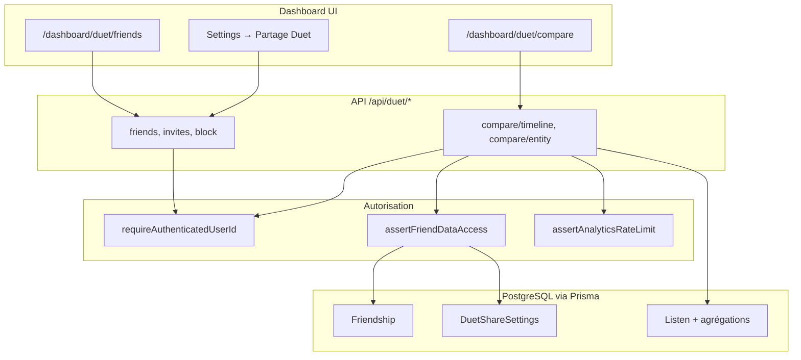

# Duet — playbook d’implémentation (social léger & comparaison)

> **Project Duet** · Résumé codename : [DUET.md](./DUET.md) · Index : [IDEAS_BAG.md](../IDEAS_BAG.md)

Document de **cadrage, audit et roadmap** pour introduire un réseau social minimal (amis, invitations, vues comparatives) dans l’app d’analytics d’écoute.

**Statut au 2026-06-10** : **Phases 0–4 terminées** (données, API, UI, QA manuel 2 comptes OK). **Phase 5** (durcissement E2E + prod) **non commencée**. Détails : [checklist go/no-go §7.5](#checklist-go--no-go-production-ue).

| Phase | Statut |
|-------|--------|
| 0 — Cadrage & juridique | ✅ Validée ([DUET_PHASE0_DECISIONS.md](./DUET_PHASE0_DECISIONS.md)) |
| 1 — Fondation données | ✅ |
| 2 — API sociale | ✅ |
| 3 — API comparaison | ✅ |
| 4 — UI MVP + QA manuel | ✅ |
| 5 — Durcissement & prod | ⏳ À faire |
| 6 — Extensions v2 | — Post-MVP |

---

## Table des matières

1. [Vision & périmètre](#1-vision--périmètre)
2. [État actuel du repo](#2-état-actuel-du-repo)
3. [Architecture cible](#3-architecture-cible)
4. [Audit : avantages, risques, implications](#4-audit--avantages-risques-implications)
5. [Décisions produit à trancher (Phase 0)](#5-décisions-produit-à-trancher-phase-0)
6. [Roadmap par phase](#6-roadmap-par-phase)
7. [Actions hors code (ta responsabilité)](#7-actions-hors-code-ta-responsabilité)
8. [Dépendances avec autres codenames](#8-dépendances-avec-autres-codenames)
9. [Références croisées](#9-références-croisées)

---

## 1. Vision & périmètre

### Constat

L’app est aujourd’hui **centrée sur un utilisateur / une bibliothèque**. Beaucoup de personnes découvrent leurs habitudes en les **mettant en perspective** avec celles d’un ami (« qui stream le plus ce groupe », « nos genres sur la même période », etc.).

### Objectif

Introduire une dynamique **réseau social minimale** — pas un fil d’actualité générique — focalisée sur :

- **Relations** : demande d’ami → acceptation / refus ; liste d’amis ; blocage.
- **Comparaison** : choisir un ami + métrique + plage de dates alignée sur les filtres dashboard.
- **Moments « wow »** : pour un **artiste**, **titre** ou **genre**, afficher un ratio « toi vs ami » sur une période.

### MVP (proposition validée dans ce playbook)

| Inclus | Exclu (post-MVP) |
|--------|------------------|
| Invitations par **email** (lookup `User.email`) | Découverte globale (« trouver des inconnus ») |
| Opt-in explicite par relation (`shareScope`) | Chat intégré |
| Liste amis + page « Comparer avec… » | Classements publics |
| Graphe **dual** timeline (2 séries) | Groupes (>2 personnes) |
| Comparaison ciblée **artiste** head-to-head | Cartes partage réseaux sociaux |

### Hors périmètre initial

- Fil d’actualité, messagerie, découverte d’inconnus, classements publics.
- Intégration Maestro (agent IA) avec données ami — **exclu du MVP**.
- Accès Duet en **mode démo publique** anonyme — **interdit**.

---

## 2. État actuel du repo

### Ce qui facilite Duet

| Élément | Emplacement | Rôle pour Duet |
|--------|-------------|----------------|
| Auth Supabase + `User` Prisma | `prisma/schema.prisma`, `lib/auth/*` | `id`, `email`, `name`, `avatarUrl` — base invitations |
| Opt-in / consent | `UserConsent`, `lib/services/user/privacy-preferences.ts` | Pattern réutilisable pour `duet_sharing` |
| Charts multi-séries | `artists/trends`, `genres/trends`, `tracks/trends` | Recharts + plusieurs `<Line>` — modèle pour graphe dual |
| Agrégations timeline | `lib/services/listening/listening-aggregation.ts` | `getDailyAggregatedListens` etc. — comparaison temporelle |
| Rate limiting analytics | `lib/security/analytics-rate-limit.ts` | `assertAnalyticsRateLimit` — à répliquer sur `/api/duet/*` |
| Suppression compte | `lib/services/user/delete-user-account.ts` | Cascade Prisma — à étendre pour friendships |
| Onboarding gate | `app/[locale]/dashboard/(main)/layout.tsx` | Utilisateurs connectés déjà guidés avant le dashboard |
| i18n | `messages/{en,fr,es}.json` | Namespace `duet` à ajouter |

### Ce qui bloque ou complique

| Élément | Détail |
|--------|--------|
| **Isolation cross-user** | `resolveAuthorizedDataUserId` (`lib/auth/resolve-authorized-data-user-id.ts`) **refuse** toute lecture d’un autre UUID que la session ou le profil démo public. Duet exige une **nouvelle couche d’autorisation**. |
| **Pas de graphe social** | Schéma Prisma sans tables `Friendship` / partage. |
| **Pas de recherche utilisateur** | Aucune API lookup email — à créer avec anti-énumération. |
| **RLS Supabase** | Prisma bypass RLS ; garde-fou principal = routes API Next.js. Script `scripts/setup-supabase-rls.sql` à étendre si Postgres = Supabase unifié. |
| **Notifications** | `notification-center` client-only — pas de persistance serveur pour demandes d’ami (v2). |

### Règle d’or auth actuelle (à ne pas contourner)

```text
Authenticated + userId query ≠ session  →  ignoré, données de la session uniquement
Anonymous + userId ≠ profil public      →  401
```

Duet **ne doit pas** réutiliser le paramètre `userId` des routes analytics existantes pour cibler un ami.

---

## 3. Architecture cible

### Schéma logique



### Modèle de données recommandé (MVP)

```prisma
enum FriendshipStatus {
  pending
  accepted
  declined
  blocked
}

enum DuetShareScope {
  none       // relation sans partage analytics
  aggregates // timeline, tops, genres — pas de listens détaillées
  full       // comparaisons ciblées artiste / titre / genre
}

model Friendship {
  id          String           @id @default(cuid())
  requesterId String
  addresseeId String
  status      FriendshipStatus @default(pending)
  shareScope  DuetShareScope   @default(none)
  createdAt   DateTime         @default(now())
  respondedAt DateTime?

  requester User @relation("FriendshipRequester", fields: [requesterId], references: [id], onDelete: Cascade)
  addressee User @relation("FriendshipAddressee", fields: [addresseeId], references: [id], onDelete: Cascade)

  @@unique([requesterId, addresseeId])
  @@index([addresseeId, status])
  @@index([requesterId, status])
}

model DuetShareSettings {
  userId              String         @id
  allowFriendRequests Boolean        @default(true)
  defaultShareScope   DuetShareScope @default(aggregates)
  user                User           @relation(fields: [userId], references: [id], onDelete: Cascade)
}
```

**Choix structurants :**

- Relation **directionnelle** (`requester` → `addressee`) + statut.
- `shareScope` sur la friendship = opt-in **par ami** à l’acceptation.
- `DuetShareSettings` = préférences globales (couper invitations, scope par défaut).
- Service métier : refuser les doublons (inverse `pending` existant).

### Namespace API dédié

| Route | Méthode | Rôle |
|-------|---------|------|
| `/api/duet/friends` | GET | Liste amis + demandes entrantes/sortantes |
| `/api/duet/friends/invite` | POST | Inviter par email |
| `/api/duet/friends/[id]` | PATCH | Accepter (avec `shareScope`) / refuser / révoquer |
| `/api/duet/friends/[id]/block` | POST | Bloquer |
| `/api/duet/settings` | GET, PATCH | Préférences partage globales |
| `/api/duet/compare/timeline` | GET | 2 séries agrégées (période + granularité) |
| `/api/duet/compare/entity` | GET | Head-to-head artiste (MVP) ; titre/genre en v2 |
| `/api/duet/compare/metadata` | GET | Couverture données ami (sources, plage, volume) |

### Garde-fou central

Fichier cible : `lib/services/duet/assert-friend-data-access.ts`

```ts
// Signature cible
assertFriendDataAccess({
  viewerId: string,       // session
  targetUserId: string,     // ami
  requiredScope: "aggregates" | "full",
}): Promise<{ ok: true } | { ok: false; status: 403 | 404 }>
```

- **404** si pas de relation `accepted` (anti-énumération).
- **403** si `shareScope` insuffisant.
- Jamais de `friendUserId` dans les routes `/api/timeline`, `/api/artists`, etc.

### Pages UI cibles

| Route | Contenu |
|-------|---------|
| `/dashboard/duet` | Redirect ou hub vers friends |
| `/dashboard/duet/friends` | Liste, demandes, formulaire invitation |
| `/dashboard/duet/compare` | Sélecteur ami + `PeriodSelector` + graphe dual |
| Settings (existant) | Section « Partage avec amis » |

### Ordre d’implémentation (résumé)

```text
Phase 0 (cadrage) → Phase 1 (schéma) → Phase 2 (API sociale)
  → Phase 3 (API compare) → Phase 4 (UI) → Phase 5 (durcissement) → Phase 6 (v2)
```

**Premier slice vertical** (~1,5–2 semaines) : email invite → accept → timeline dual.  
**Deuxième slice** (~1 semaine) : comparaison artiste + metadata équité données.

---

## 4. Audit : avantages, risques, implications

### Avantages

| Catégorie | Détail |
|-----------|--------|
| **Produit** | Rétention, bouche-à-oreille, différenciation sans réseau social généraliste |
| **Technique** | Réutilisation charts multi-séries, agrégations SQL, patterns auth/consent/rate-limit |
| **Scope** | Feature délimitée ; namespace API isolé `/api/duet/*` |
| **Données** | Index `Listen (userId, playedAt)` — comparaisons temporelles viables |
| **UX** | Pages trends prouvent l’affichage multi-séries (Recharts) |

### Risques & mitigations

| Risque | Mitigation |
|--------|------------|
| Fuite cross-user via `userId` / injection | Namespace `/api/duet/*` + `assertFriendDataAccess` ; 404 systématique |
| Énumération emails | Réponse uniforme « invitation traitée » + rate limit strict |
| Coût DB ×2 | `Promise.all` sur agrégations ; cache Redis optionnel TTL court |
| Comparaisons trompeuses (historiques différents) | `compare/metadata` + bandeau UI obligatoire |
| Spam invitations | Quotas (ex. 10/jour), blocage, plafond amis (ex. 50) |
| RGPD — nouveau traitement social | Revue juridique, ROPA, consentement à l’acceptation (voir §7) |
| Maestro fuite données ami | Exclure des tools allowlistés jusqu’à phase dédiée |
| Headliner — artistes fragmentés | Documenter limitation MVP ; comparaisons artiste moins fiables sans Headliner |

### Implications architecture

1. Nouveau domaine `lib/services/duet/` — **ne pas** étendre `resolveAuthorizedDataUserId`.
2. Routes analytics solo **inchangées**.
3. Duet **auth-only** — pas de `?userId=` démo.
4. Consent audit : type `duet_sharing` dans `UserConsent` à l’acceptation.
5. `deleteUserAccount` : cascade friendships requester + addressee.
6. i18n : ~80–120 clés namespace `duet` (en, fr, es).
7. Mettre à jour `docs/API.md`, `PUBLIC_DEMO_ROUTES_ADVISORY.md`, `GDPR_ROPA.md`.

---

## 5. Décisions produit à trancher (Phase 0)

Avant le premier commit code, valider ces choix (défauts recommandés entre **guillemets**) :

| # | Question | Défaut recommandé |
|---|----------|-------------------|
| D1 | Opt-in par ami ou global seul ? | **Par ami** (`shareScope` sur `Friendship`) + settings globales |
| D2 | Niveaux de partage | **`aggregates`** (timeline, tops) et **`full`** (entité ciblée) |
| D3 | Canal invitation MVP | **Email** uniquement |
| D4 | Réponse si email inconnu | **Message uniforme** (pas de « compte introuvable ») |
| D5 | Invitations si compte absent | **v2** — MVP : invitation uniquement si `User` existe |
| D6 | Métriques MVP | **Timeline dual** + **head-to-head artiste** |
| D7 | Accès démo publique | **Fermé** (session obligatoire) |
| D8 | Plafond amis | **50** |
| D9 | Quota invitations / jour | **10** par utilisateur |
| D10 | Texte légal consentement partage | **Auto-évaluation interne** — ROPA, privacy, `DUET_SHARING_CONSENT_VERSION` `2026-06-09` (voir [DUET_PHASE0_DECISIONS.md](./DUET_PHASE0_DECISIONS.md), [GDPR_DPIA_DUET.md](./GDPR_DPIA_DUET.md)) |

Cocher dans la section [Actions hors code](#7-actions-hors-code-ta-responsabilité) quand tranché.

---

## 6. Roadmap par phase

### Phase 0 — Cadrage produit & juridique ✅

**Durée estimée** : 2–3 jours (dont actions humaines en parallèle).  
**Bloquant** : oui, avant migration Prisma.  
**Statut** : **terminée** (2026-06-09).

| # | Livrable |
|---|----------|
| 0.1 | Fiche décisions D1–D10 validée |
| 0.2 | Schéma Prisma validé (section §3) |
| 0.3 | Brouillon texte consentement « partage avec amis » |
| 0.4 | Entrée prévue sidebar : libellé + icône + groupe nav |

#### Prompt agent — Phase 0

> **Project Duet — Phase 0 (cadrage, sans code produit)**  
> Lis `docs/DUET.md`, `docs/DUET_PLAYBOOK.md` et `IDEAS_BAG.md`. Produis un fichier `docs/DUET_PHASE0_DECISIONS.md` qui reprend les décisions D1–D10 du playbook avec la **recommandation par défaut** et une colonne « Décision finale » vide à remplir. Ajoute un brouillon de copy UX (FR/EN/ES) pour : (1) écran d’acceptation d’invitation avec choix `aggregates` / `full`, (2) bandeau « données ami incomplètes », (3) mention consentement court. Mets à jour `docs/DUET.md` pour lier vers `DUET_PLAYBOOK.md`. **Ne modifie pas** le schéma Prisma ni les routes API dans cette phase.

#### Actions humaines — Phase 0

Voir [§7.1](#71-phase-0--cadrage-et-juridique).

---

### Phase 1 — Fondation données ✅

**Durée estimée** : 3–4 jours.  
**Statut** : **terminée**.

| # | Tâche | Fichiers |
|---|-------|----------|
| 1.1 | Enums + models Prisma | `prisma/schema.prisma` |
| 1.2 | Migration | `prisma/migrations/*` |
| 1.3 | Service friendships | `lib/services/duet/friendship-service.ts` |
| 1.4 | Service settings | `lib/services/duet/duet-share-settings-service.ts` |
| 1.5 | Assert friend access (squelette) | `lib/services/duet/assert-friend-data-access.ts` |
| 1.6 | RLS Supabase (si applicable) | `scripts/setup-supabase-rls.sql` |
| 1.7 | Cascade delete account | `lib/services/user/delete-user-account.ts` |
| 1.8 | Tests Vitest service | `__tests__/lib/duet/friendship-service.test.ts` |

**Critère de sortie** : créer / accepter / refuser / bloquer une relation via service + tests verts.

#### Prompt agent — Phase 1

> **Project Duet — Phase 1 (fondation données)**  
> Implémente le socle Prisma pour Duet selon `docs/DUET_PLAYBOOK.md` §3 : enums `FriendshipStatus`, `DuetShareScope`, models `Friendship` et `DuetShareSettings`, relations sur `User`, migration Prisma. Crée `lib/services/duet/friendship-service.ts` (invite, accept avec `shareScope`, decline, revoke, block, list friends + pending in/out) et `lib/services/duet/duet-share-settings-service.ts`. Implémente `assertFriendDataAccess` (404 si pas `accepted`, 403 si scope insuffisant). Étends `deleteUserAccount` pour supprimer les friendships liées. Ajoute les policies RLS dans `scripts/setup-supabase-rls.sql` **uniquement** si le commentaire d’en-tête du script confirme que les tables Prisma vivent dans Supabase Postgres. Tests Vitest sur `friendship-service` (happy path + block + duplicate invite). **Ne crée pas encore** les routes HTTP ni l’UI.

#### Actions humaines — Phase 1

Voir [§7.2](#72-phase-1--base-de-données).

---

### Phase 2 — API sociale ✅

**Durée estimée** : 3–4 jours.  
**Statut** : **terminée**.

| # | Tâche |
|---|-------|
| 2.1 | `GET/POST /api/duet/friends/*` — auth obligatoire, Zod |
| 2.2 | Invitation email — normalisation, anti-auto-invite, quota/jour |
| 2.3 | `GET/PATCH /api/duet/settings` |
| 2.4 | Rate limit dédié (invites + mutations) |
| 2.5 | Logging sécurité sur refus / blocage |
| 2.6 | Documentation `docs/API.md` |
| 2.7 | Tests API | `__tests__/api/duet-friends.test.ts` |

**Critère de sortie** : parcours API invite → accept ; 401 sans session ; 404 lecture cible non-ami.

#### Prompt agent — Phase 2

> **Project Duet — Phase 2 (API sociale)**  
> Crée les routes sous `app/api/duet/` : `friends/route.ts` (GET liste), `friends/invite/route.ts` (POST email), `friends/[id]/route.ts` (PATCH accept/decline/revoke), `friends/[id]/block/route.ts`, `settings/route.ts` (GET/PATCH). Toutes les routes exigent une session (`requireAuthenticatedUserId`). Invitation par email : lookup `User.email` (insensible à la casse), refuser auto-invite, réponse **uniforme** anti-énumération, max 10 invites/jour/utilisateur (configurable). Enregistre un consent `duet_sharing` via `recordUserConsent` à l’**acceptation** avec version définie dans `lib/constants/legal-consent.ts` (ajouter constante `DUET_SHARING_CONSENT_VERSION`). Rate limit aligné sur les routes sensibles existantes. Documente dans `docs/API.md`. Tests dans `__tests__/api/duet-friends.test.ts`. **Ne crée pas** les endpoints `compare/*` ni l’UI.

#### Actions humaines — Phase 2

Voir [§7.3](#73-phase-2--légal-et-consentement).

---

### Phase 3 — API comparaison ✅

**Durée estimée** : 4–5 jours.  
**Statut** : **terminée**.

| # | Tâche | Réutilisation |
|---|-------|---------------|
| 3.1 | `GET /api/duet/compare/timeline` | `listening-aggregation.ts` × 2 users, merge dates |
| 3.2 | `GET /api/duet/compare/entity?type=artist&entityId=…` | COUNT SQL par `artistId` |
| 3.3 | `GET /api/duet/compare/metadata` | `getListenDateRange`, sources, totaux |
| 3.4 | Rate limit analytics | `assertAnalyticsRateLimit` |
| 3.5 | Tests sécurité | Sans relation → 404 ; scope `none` → 403 |

**Critère de sortie** : timeline `{ self, friend, merged }` ; entity `{ selfCount, friendCount, winner }` ; metadata exploitable par l’UI.

#### Prompt agent — Phase 3

> **Project Duet — Phase 3 (API comparaison)**  
> Ajoute `app/api/duet/compare/timeline/route.ts`, `entity/route.ts`, `metadata/route.ts`. Chaque route : session obligatoire + `assertFriendDataAccess` avec `friendUserId` en query (UUID validé). Timeline : réutilise `getDailyAggregatedListens` / weekly / monthly selon `period`, exécute **en parallèle** pour viewer et ami, fusionne par date avec libellés `self` / `friend`. Entity MVP : `type=artist` + `entityId` + plage dates → compteurs head-to-head. Metadata : plage min/max, total listens, sources distinctes (`Listen.source`) pour l’ami. `assertAnalyticsRateLimit` sur chaque route (plafond aligné `/api/timeline`). Limite plage temporelle max 2 ans si > 50k listens (documenter). Tests : `__tests__/api/duet-compare.test.ts` (happy path, 403 scope, 404 stranger). Mets à jour `docs/API.md`. **Pas d’UI** dans cette phase.

#### Actions humaines — Phase 3

Aucune action bloquante hors code. Optionnel : tester manuellement avec 2 comptes de test (voir §7.4).

---

### Phase 4 — UI MVP ✅

**Durée estimée** : 5–7 jours.  
**Statut** : **terminée** — QA manuel 2 comptes validé (invite → accept → compare → revoke → blocage).

| # | Écran |
|---|-------|
| 4.1 | `/dashboard/duet/friends` — liste, pending, invite form |
| 4.2 | `/dashboard/duet/compare` — ami + période + graphe dual (pattern `timeline/page.tsx`) |
| 4.3 | Widget head-to-head artiste (picker ou depuis page artiste) |
| 4.4 | Settings — section partage Duet |
| 4.5 | Sidebar + mobile nav |
| 4.6 | i18n `duet` en/fr/es |
| 4.7 | Empty states (pas d’amis, ami sans données, scope insuffisant) |

**Critère de sortie** : A invite B par email → B accepte → A voit graphe comparatif 30 jours.

#### Prompt agent — Phase 4

> **Project Duet — Phase 4 (UI MVP)**  
> Crée `app/[locale]/dashboard/(main)/duet/friends/page.tsx` et `duet/compare/page.tsx`. Réutilise `PeriodSelector`, `ChartResponsiveContainer`, thème `DASHBOARD_CHART_THEME`, patterns de `timeline/page.tsx` pour un **LineChart à 2 séries** (moi / ami) alimenté par `/api/duet/compare/timeline`. Page friends : hooks TanStack Query vers `/api/duet/friends`, formulaire invitation email, actions accept/decline/block. Bandeau metadata depuis `/api/duet/compare/metadata` si couverture données inégale. Section settings dans `account-settings-client.tsx` ou fichier dédié pour `/api/duet/settings`. Ajoute entrée navigation dans `lib/components/sidebar.tsx` et `dashboard-mobile-bottom-nav.tsx` (groupe dédié « Social » ou « Duet »). i18n namespace `duet` dans `messages/en.json`, `fr.json`, `es.json`. **Auth only** : si pas de session, redirect sign-in. **Ne pas** exposer via `?userId=` profil public. Empty states avec `EmptyState`.

#### Actions humaines — Phase 4

Voir [§7.4](#74-phase-4--tests-manuels-et-comptes).

---

### Phase 5 — Durcissement ⏳

**Durée estimée** : 2–3 jours.  
**Statut** : **non commencée** — prochaine étape avant prod.

| # | Tâche |
|---|-------|
| 5.1 | Tests E2E Playwright : invite → accept → compare |
| 5.2 | Audit fuite : fuzz `friendUserId` sur routes existantes |
| 5.3 | Breakwater : Duet absent démo publique ; guard middleware si besoin |
| 5.4 | Vérif Maestro / music-chat : pas d’accès données ami |
| 5.5 | Plafond 50 amis, monitoring rate limit |
| 5.6 | Mise à jour `PUBLIC_DEMO_ROUTES_ADVISORY.md` |

**Critère de sortie** : E2E vert ; aucune route solo ne lit un ami via `userId` ; Duet invisible en démo anonyme.

#### Prompt agent — Phase 5

> **Project Duet — Phase 5 (durcissement)**  
> Ajoute test E2E Playwright `e2e/duet-compare.spec.ts` (2 comptes ou mock session selon setup repo). Vérifie que `resolveAuthorizedDataUserId` et routes `/api/timeline`, `/api/artists` **ne permettent pas** la lecture d’un ami via `userId`. Confirme que pages `/dashboard/duet/*` redirigent ou 401 sans session et sont **absentes** du parcours public demo (`usePublicDemoViewer`). Mets à jour `docs/PUBLIC_DEMO_ROUTES_ADVISORY.md` : classer `/dashboard/duet/*` en **Fermer** (auth obligatoire). Documente dans `docs/DUET_PLAYBOOK.md` si écart. Audit rapide `lib/services/ai/music-chat-tools.ts` : aucun tool ne doit accepter `friendUserId`. Renforce tests API edge cases (blocked user, revoked friendship).

#### Actions humaines — Phase 5

Voir [§7.5](#75-phase-5--mise-en-production).

---

### Phase 6 — Extensions v2 (post-MVP)

Priorité suggérée :

1. Comparaisons **titre** et **genre** (`compare/entity` étendu).
2. Top artistes **partagés** (intersection tops).
3. Notifications persistantes (demandes d’ami).
4. Lien d’invitation signé (token 7j) si email trop frictionnel.
5. Cartes partageables (alignement Encore / Setlist).
6. Groupes (>2 utilisateurs).

#### Prompt agent — Phase 6a (comparaisons titre/genre)

> **Project Duet — Phase 6a**  
> Étends `GET /api/duet/compare/entity` pour `type=track` et `type=genre`. UI : picker depuis pages tracks/genres existantes. Réutilise les DTO et patterns de `tracks/trends` / `genres/trends`. Tests API + empty states. Documente limites Headliner (artistes fragmentés) dans `docs/DUET.md`.

#### Prompt agent — Phase 6b (invitation par lien)

> **Project Duet — Phase 6b**  
> Ajoute invitations par lien : token signé HMAC, expiration 7 jours, table `DuetInviteToken` ou champ sur `Friendship`. Route `POST /api/duet/friends/invite-link` et page `/duet/accept?token=`. Rate limit strict. **Ne pas** exposer de données analytics dans la page d’accept (landing auth only).

#### Prompt agent — Phase 6c (notifications persistantes)

> **Project Duet — Phase 6c**  
> Persistance serveur des demandes d’ami en attente : badge dans `notification-center`, polling ou invalidation React Query sur accept. Optionnel : email transactionnel via Supabase (si configuré).

---

## 7. Actions hors code (ta responsabilité)

### 7.1 Phase 0 — Cadrage et juridique

| Action | Détail exact | Quand | Statut |
|--------|--------------|-------|--------|
| **Valider D1–D10** | `docs/DUET_PHASE0_DECISIONS.md` | Avant Phase 1 | ✅ 2026-06-09 |
| **Revue RGPD externe** | [GDPR_LEGAL_REVIEW_CHECKLIST.md](./GDPR_LEGAL_REVIEW_CHECKLIST.md) §6 | Parallèle Phase 0–1 | ⏭️ Différée (auto-évaluation retenue) |
| **Mettre à jour ROPA** | [GDPR_ROPA.md](./GDPR_ROPA.md) — ligne « Partage Duet » | Avant prod UE | ✅ 2026-06-09 |
| **Texte consentement** | `DUET_SHARING_CONSENT_VERSION` = `2026-06-09` ; copy §2.3 Phase 0 | Avant Phase 2 | ✅ |
| **Politique de confidentialité** | Section Duet dans `messages/*/legal.privacy` | Avant prod UE | ✅ 2026-06-09 |
| **DPIA Duet** | [GDPR_DPIA_DUET.md](./GDPR_DPIA_DUET.md) | Avant prod UE | ✅ 2026-06-09 (interne) |

### 7.2 Phase 1 — Base de données

| Action | Détail exact | Quand |
|--------|--------------|-------|
| **Migration Prisma** | Après merge Phase 1 en local : `npx prisma migrate dev` (dev) ou applique la migration en staging/prod selon [DB_ENV_WORKFLOW.md](./DB_ENV_WORKFLOW.md). | Après PR Phase 1 |
| **RLS Supabase** | **Uniquement si** `DATABASE_URL` pointe vers Supabase Postgres (voir avertissement en tête de `scripts/setup-supabase-rls.sql`). Sinon (Neon + Supabase Auth seul) : **ne pas** exécuter le script — protection = API Next.js. | Après migration, si applicable |
| **Vérifier split DB** | Confirme dans `.env` : même Postgres pour Prisma et Auth, ou split. Ça détermine si RLS est pertinent. | Avant exécuter SQL |

### 7.3 Phase 2 — Légal et consentement

| Action | Détail exact | Quand | Statut |
|--------|--------------|-------|--------|
| **Version consentement** | `DUET_SHARING_CONSENT_VERSION` = `2026-06-09` | Avant merge Phase 2 | ✅ |
| **Email transactionnel (optionnel)** | SMTP / Supabase / Resend — hors scope MVP | v2 | — |

### 7.4 Phase 4 — Tests manuels et comptes

| Action | Détail exact | Quand | Statut |
|--------|--------------|-------|--------|
| **2 comptes de test** | 2 utilisateurs Supabase avec imports sur la même période | Avant QA Phase 4 | ✅ |
| **Scénario manuel** | Invite → accept `aggregates` → compare timeline → revoke → 404 → blocage | Avant prod | ✅ 2026-06-10 |
| **Copy UX** | Relire `duet.*` en/fr/es | Avant prod | ☐ Optionnel |
| **Redirect anonyme** | `/dashboard/duet/*` → sign-in (`duet/layout.tsx`) | Avant prod | ✅ |

### 7.5 Phase 5 — Mise en production

| Action | Détail exact | Quand |
|--------|--------------|-------|
| **Staging** | Déploie sur environnement de preview ; exécute migration prod-like ; teste E2E ou scénario manuel §7.4. | Avant merge main |
| **Feature flag (optionnel)** | Si tu veux déployer sans activer : variable env `DUET_ENABLED=false` — à demander à l’agent si souhaité ; sinon masquer entrée sidebar jusqu’à go. | Optionnel |
| **Annonce produit** | Prépare release note : Duet = bêta, invitations limitées, pas de découverte publique. | Au lancement |
| **Monitoring** | Surveille rate limit admin (`/api/admin/rate-limit/*`) et Sentry pour 403/404 massifs sur `/api/duet/*`. | Post-launch |

### Checklist go / no-go production UE

> **Dev / staging (Phases 0–4)** : prêt pour Phase 5.  
> **Prod UE** : cocher les cases ☐ restantes avant ouverture publique.

#### Conformité & cadrage

- [x] D1–D10 validées et documentées ([DUET_PHASE0_DECISIONS.md](./DUET_PHASE0_DECISIONS.md))
- [x] ROPA mis à jour ([GDPR_ROPA.md](./GDPR_ROPA.md) — Partage Duet)
- [x] Politique de confidentialité mise à jour (section Duet, 2026-06-09)
- [x] Consentement `duet_sharing` versionné et tracé (`UserConsent`, version `2026-06-09`)
- [x] DPIA Duet documentée ([GDPR_DPIA_DUET.md](./GDPR_DPIA_DUET.md) — auto-évaluation)
- [ ] Revue juridique externe *(différée — optionnelle pour MVP)*

#### Qualité & sécurité (dev / QA)

- [x] Migration appliquée en **dev** (local)
- [x] Scénario manuel 2 comptes OK (§7.4)
- [x] Duet absent / bloqué en démo publique anonyme (sidebar + redirect `duet/layout.tsx`)
- [x] Garde-fous cross-user (`assertFriendDataAccess` + routes `/api/duet/compare/*`)

#### Phase 5 — avant prod

- [ ] Migration appliquée en **prod**
- [ ] Staging preview + smoke test §7.4
- [ ] Tests E2E Playwright (invite → accept → compare)
- [ ] Audit fuite : routes analytics solo + Maestro sans accès ami via `userId`
- [ ] `PUBLIC_DEMO_ROUTES_ADVISORY.md` mis à jour (`/dashboard/duet/*` → Fermer)
- [ ] Monitoring post-launch (rate limit, Sentry 403/404 sur `/api/duet/*`)

---

## 8. Dépendances avec autres codenames

| Codename | Lien |
|----------|------|
| **Breakwater** | Duet **fermé** au public ; APIs auth-only |
| **CurtainCall** | Indirect — sessions longues OK pour usage social |
| **Headliner** | Améliore justesse comparaisons artiste — limiter promesse MVP |
| **Setlist** | Comparaisons titre plus riches après stabilité Setlist |
| **Maestro** | **Exclure** du MVP — risque fuite données ami |
| **Encore** | Cartes partage comparatives en v2 |
| **Palette** | Aucun lien direct ; même pattern auth-only que Palette en démo |

---

## 9. Références croisées

| Document | Rôle |
|----------|------|
| [DUET.md](./DUET.md) | Résumé codename |
| [IDEAS_BAG.md](../IDEAS_BAG.md) | Index sac à idées |
| [API.md](./API.md) | Référence routes (à compléter) |
| [BREAKWATER.md](./BREAKWATER.md) | Démo publique |
| [PUBLIC_DEMO_ROUTES_ADVISORY.md](./PUBLIC_DEMO_ROUTES_ADVISORY.md) | Route map — ajouter `/dashboard/duet/*` |
| [GDPR_ROPA.md](./GDPR_ROPA.md) | Registre traitements |
| [GDPR_LEGAL_REVIEW_CHECKLIST.md](./GDPR_LEGAL_REVIEW_CHECKLIST.md) | Revue juridique |
| [DB_ENV_WORKFLOW.md](./DB_ENV_WORKFLOW.md) | Migrations env |
| `lib/auth/resolve-authorized-data-user-id.ts` | Auth solo actuelle |
| `app/[locale]/dashboard/(main)/timeline/page.tsx` | Référence graphe |
| `app/[locale]/dashboard/(main)/artists/trends/page.tsx` | Référence multi-séries |

---

## Prompt agent — implémentation complète (une session longue)

> **Project Duet — Socle complet MVP**  
> Suis `docs/DUET_PLAYBOOK.md` phases 1 à 4 dans l’ordre. Modèle `Friendship` + `DuetShareSettings`, services `lib/services/duet/*`, routes `/api/duet/friends/*`, `/api/duet/compare/timeline`, `/api/duet/compare/entity` (artiste), `/api/duet/compare/metadata`, pages `/dashboard/duet/friends` et `/dashboard/duet/compare` avec graphe dual timeline. Auth obligatoire ; `assertFriendDataAccess` sur toute lecture ami ; consent `duet_sharing` à l’acceptation ; rate limits ; tests Vitest API + service ; i18n en/fr/es ; entrée sidebar. **Ne pas** étendre `resolveAuthorizedDataUserId` ni les routes analytics existantes avec `friendUserId`. Documente dans `docs/API.md`. Phase 5 (E2E + PUBLIC_DEMO) si le temps le permet.

---

*Dernière mise à jour : 2026-06-10 — Phases 0–4 terminées ; Phase 5 à venir.*
